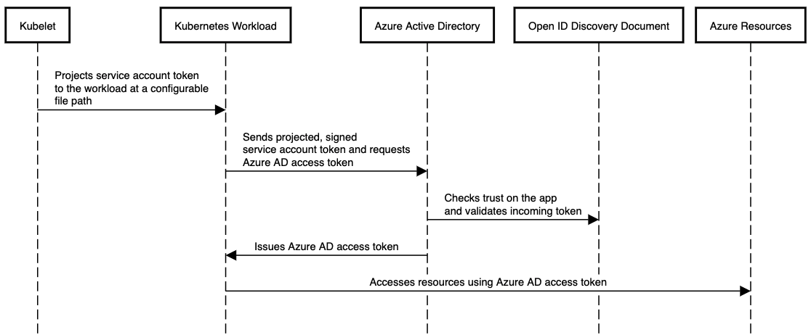
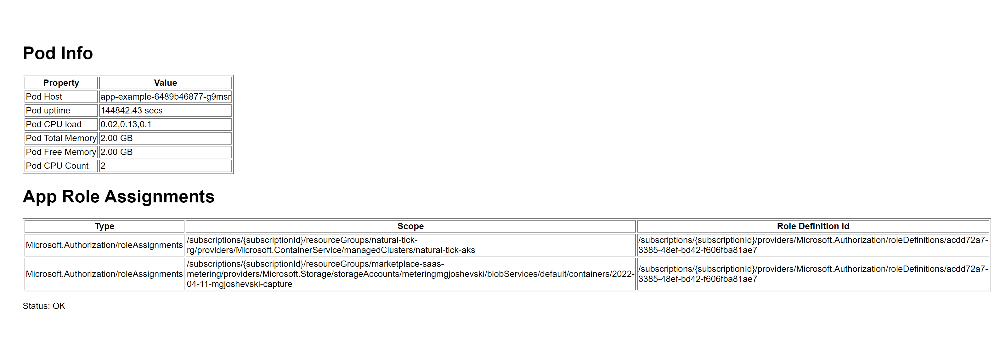
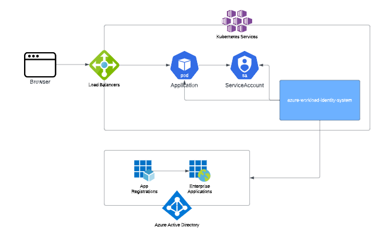

# Use Azure AD workload identity to securely access Azure services or resource from your Kubernetes cluster - Sample using AKS provisoned by Terraform

A common challenge architects and developers face when designing a Kubernetes solution is how to grant containerized workload permissions to access an Azure service or resource.

To avoid the need for developers to manage credentials, recommended way is to use Managed identities.

[Managed identities](https://docs.microsoft.com/en-gb/azure/active-directory/managed-identities-azure-resources/overview
) provide an identity for applications to use when connecting to resources that support Azure Active Directory (Azure AD) authentication. Applications may use the managed identity to obtain Azure AD tokens.

Besides eliminating the need for managing credentials, Managed identities provide aditional benefits like useing managed identities to authenticate to any resource that supports Azure AD authentication, including your own applications.

It is worth mentioning that Managed identities can be used without any additional cost.

## Azure AD workload identity

Azure AD Workload Identity for Kubernetes is na open-source project that integrates with the capabilities native to Kubernetes to federate with external identity providers.  It leverages the public preview capability of [Azure AD workload identity federation](https://docs.microsoft.com/en-us/azure/active-directory/develop/workload-identity-federation). With this project, developers can use native Kubernetes concepts of [service accounts](https://kubernetes.io/docs/tasks/configure-pod-container/configure-service-account/) and federation to access Azure AD protected resources, such as Azure and Microsoft Graph, without needing secrets.

The existing [Azure AD Pod Identity project](https://github.com/Azure/aad-pod-identity) addresses this need. However, the Azure AD workload identity approach is simpler to use and deploy, and overcomes several limitations in Azure AD Pod Identity:

- Removes the scale and performance issues that existed for identity assignment.
- Supports Kubernetes clusters hosted in any cloud.
- Supports both Linux and Windows workloads.
- Removes the need for Custom Resource Definitions and pods that intercept IMDS (Instance Metadata Service) traffic.
- Avoids the complication and error-prone installation steps such as cluster role assignment.

### How it works

In this model, the Kubernetes cluster becomes a token issuer, issuing tokens to Kubernetes Service Accounts. These service account tokens can be configured to be trusted on Azure AD applications. Workload can exchange a service account token projected to its volume for an Azure AD access token using the Azure Identity SDKs or the Microsoft Authentication Library (MSAL).

To read more please following this [link](https://azure.github.io/azure-workload-identity/docs/introduction.html).

## Sample overview

### Application 

In this sample we will deploy our Node.js application that provides information regarding the pod in which it runs and lists all of the roles it has assigned. The roles assigned give us view in the permissions this app has and which services it can connect to and use.

#### Source code 

The main logic of the sample application can be found in `App/routes/index.js`.

If we examine the _getAppRoleAssignments()_ function we can see that the application uses the [@azure/identity](https://www.npmjs.com/package/@azure/identity) library to perform the authorization.

In order to use the _AuthorizationManagementClient_ and obtain the role assignments for our application we need to provide credentials.

The credentials are obtained by simply using the constructor without any need for the developer to provide the  _client id_ or _client secret_.

This credentials are exposed to the application through the workload identity hook.

`

    async function getAppRoleAssignments() {

        const credential = new DefaultAzureCredential();
        const client = new AuthorizationManagementClient(credential, subscriptionId);

        return client.roleAssignments.listForScope(`subscriptions/${subscriptionId}`, { filter: `assignedTo('{${servicePrincipalObjectId}}')` });

    }

`

### Infrastructure

All of the required components  to run the application and leverage the Azure Workload Identity project are part of the _main.tf_ template in the Infra folder. On the below diagram you can see the main components created by our terraform template:

## Walkthrough 

This quick start demonstrate how Azure AD Workload Identity works with AKS cluster. We will use Terraform to provision all of the resources required for our Node.js application to run and connect to other Azure services.

### Prerequisites

For this tutorial, you will need:

- an Azure account - [get one for free](https://azure.microsoft.com/en-gb/free/)
- a configured [Azure CLI](https://docs.microsoft.com/en-us/cli/azure/)
- installed [kubectl](https://kubernetes.io/docs/tasks/tools/)
- installed [Terraform](https://learn.hashicorp.com/tutorials/terraform/install-cli)
- 
- Enable:  https://docs.microsoft.com/en-us/azure/aks/cluster-configuration#oidc-issuer-preview

#### A) Validate Azure CLI

#### B) Initialize Terraform
`
$ terraform init
`

#### C) Provision the AKS cluster

#### D) Validate the deployment 

### Clean up your workspace

Congratulations, you have provisioned an AKS cluster, configured kubectl, and visited the Kubernetes dashboard.

`
$ terraform destroy
`